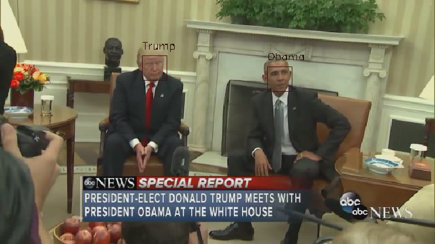

# face-recognize
Face recognition with `OpenFace` library

- Test snapshot

- For full video, please visit [this link](https://www.youtube.com/watch?v=xQgke3253wk)

 `openface` 모듈을 이용한 얼굴인식기입니다.

## Structure

1. `dlib`을 사용하여 face detection 수행 후 `OpenFace` 를 사용하여 embedding
2. 임베딩된 벡터를 SVM을 사용하여 classification model 생성
3. 입력 영상에 대해 과정 1 수행 후, 과정 2의 SVM 을 사용하여 영상의 얼굴 인식

## Details

`face_detection.py` 모듈의 `FaceDetector`을 이용하여 편리하게 SVM을 훈련시키고 사용할 수 있습니다.

 기본적인 함수는 `append_dir` 과 `append_data`입니다. 각 함수의 첫 번째 인자는 레이블입니다. 예를 들어 오바마 대통령의 데이터를 훈련시키고 싶다면, 레이블은 `'Obama'`정도가 될 것입니다. 두 번째 인자는 96x96 사이즈로 align된 이미지들이 들어있는 디렉토리 혹은 그러한 이미지의 `numpy` 배열의 리스트입니다. 이미지를 align하는 것은 `OpenCV`에서 따로 만들어 지원하므로 구현하지 않았습니다. classification model로 deep learning이 아니라 SVM을 이용하므로 크게 많지는 않아도 되며, 대략 30장 정도면 충분한 것으로 보입니다.

 모델을 훈련시켰으면 `save`와 `load` 함수를 이용하여 SVM을 저장하고 로드할 수 있습니다. 인자는 저장할 디렉토리명을 받습니다. 이는 본 클래스의 정보를 저장한 파일과 SVM의 파일 두 가지가 저장되기 때문입니다. 만약 디렉토리가 존재하지 않는다면 새로 생성합니다.

 마지막으로 predict 이미지를 받아 그게 누구인지를 예측할 수 있습니다. 입력은 훈련 때와 마찬가지로 96x96사이즈로 align된 이미지의 `numpy` 배열을 받습니다. 훈련할 때 입력했던 레이블 중 하나를 출력으로 돌려줍니다.

 `face_detection_example.py` 파일에는 그 예시가 있습니다. Training part에서 모델을 훈련시키고, prediction part에서는 영상에서 얼굴을 추출, align하여 그게 누구인지 설명을 붙여줍니다. 훈련 데이터는 오바마 대통령과 트럼프 대통령, 그리고 둘 다 아닌 사람을 구분하기 위한 랜덤한 얼굴 데이터입니다. Prediction이 끝나면 이를 mp4파일로 출력합니다.

 `example_result.mp4`파일은 이 과정을 통해 생성된 파일로, 어느 인터뷰 영상에서 오바마 대통령과 트럼프 대통령, 그리고 모르는 사람을 잘 분리해줍니다.

 `video_face_tracker.py`는 이를 조금 더 쉽게 하기 위해 만든 모듈로서, `FaceInfo`클래스는 어떤 영상의 한 프레임에서 얼굴이 발견되었을 때, 그 다음 프레임에서 거의 같은 위치에 얼굴이 있으면 이를 같은 얼굴로 간주하여 표시해줍니다. 본 모듈의 사용 예시는 파일에 포함되어있습니다.

 `test_video.avi` 파일은 이 과정을 통해 생성된 파일로, 어느 인터뷰 영상에서 같은 사람으로 판단되는 얼굴에 같은 숫자를 붙여줍니다.
본 알고리즘은 오직 '영역'만을 비교하지, 그 영역 내의 얼굴을 비교하는 과정이 없어 모든 프레임에서 얼굴을 비교하는 것보다 빠릅니다.
그러나 `dlib`을 사용하여 얼굴을 탐지하는 과정 자체가 시간이 걸리는 과정이라 속도가 만족할만큼 빠르지는 않았던 점이 아쉽습니다.